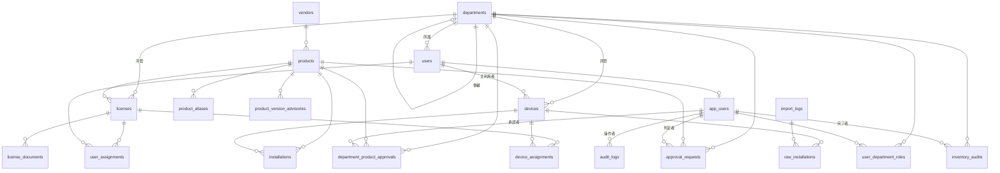

# アプリケーション管理システム ― 要件定義書

本書は実装担当（AI コーディングエージェント・Claude Code）に対する仕様指示書である。背景・設計思想は `01_背景と目的.md` を参照のこと。本書の指示と背景文書の思想が矛盾する場合、背景文書を優先する。

---

## 1. システム概要

社内のソフトウェアライセンス・承認状態を集約管理し、SKYSEA（端末インベントリ）および AD（人事マスタ）と連携して、ライセンス過不足・未承認/禁止ソフトの利用・退職者の未解除アカウントを可視化する Web アプリケーション。一般社員もログインして、自分のライセンス割当の確認や全社の承認状況検索ができる。

- **動作環境**：Windows Server（Windows Service として稼働）
- **利用者数**：300 名規模、同時アクセス数人未満
- **アクセス範囲**：社内ネットワークのみ

---

## 2. 技術スタック

| 層                 | 採用                         | 備考                                         |
| ------------------ | ---------------------------- | -------------------------------------------- |
| 言語               | Go (1.22 以上)               | 単一バイナリ配置、後任者の保守性             |
| Web フレームワーク | Echo または Chi（薄め推奨）  | 過剰な抽象化を避ける                         |
| DB                 | SQLite 3                     | `PRAGMA journal_mode=WAL` 必須               |
| DB ドライバ        | `modernc.org/sqlite`         | pure Go、CGO 不要、Windows でビルド容易      |
| クエリ生成         | `sqlc`                       | 型安全、SQL 直書き                           |
| マイグレーション   | `golang-migrate`             | バージョン管理されたスキーマ進化             |
| HTML テンプレート  | `templ` + HTMX               | サーバサイドレンダリング、SPA は構築しない   |
| LDAP               | `go-ldap/ldap/v3`            | 本番環境の AD 連携用                         |
| YAML               | `gopkg.in/yaml.v3`           | 設定ファイル・`meta.yml`                     |
| Excel 出力         | `xuri/excelize/v2`           | エクスポート機能                             |
| メール送信         | `net/smtp`（標準ライブラリ） | 通知                                         |
| HTTP クライアント  | `net/http`（標準）           | Teams Webhook 等                             |
| パスワードハッシュ | `golang.org/x/crypto/bcrypt` | ローカル認証                                 |
| 設定               | YAML ファイル + 環境変数     | 環境変数は機密のみ（SMTP/LDAP パスワード等） |
| サービス化         | WinSW または nssm            | 配置時に外部ツールで対応                     |
| ログ               | `log/slog`（標準）           | 構造化ログ                                   |

**禁止事項**：

- SPA（React/Vue 等）の採用
- ORM の使用（GORM 等）。SQL は sqlc で直書き
- **外部 CDN への依存**。CSS/JS（Tailwind、HTMX 等）は同梱・自己ホストする。`<script src="https://cdn...">` の使用を禁止
- CGO を必要とするライブラリ

---

## 3. システム構成

### 3.1 プロジェクト構造

CLI は機能別に独立したバイナリとして分割する。タスクスケジューラから個別に呼び出せ、依存性を最小化する。

```text
app-manager/
├── cmd/                       # 各バイナリのエントリポイント
│   ├── server/                # appmgr-server         : Web サーバ本体
│   │   └── main.go
│   ├── sync-directory/        # appmgr-sync-directory : AD/CSV 同期
│   │   └── main.go
│   ├── import-skysea/         # appmgr-import-skysea  : SKYSEA CSV 取込み
│   │   └── main.go
│   ├── check-integrity/       # appmgr-check-integrity: FS↔DB 整合性
│   │   └── main.go
│   ├── notify/                # appmgr-notify         : 日次通知送信
│   │   └── main.go
│   ├── backup/                # appmgr-backup         : DB バックアップ
│   │   └── main.go
│   ├── generate-meta/         # appmgr-generate-meta  : meta.yml 一括再生成
│   │   └── main.go
│   └── create-app-user/       # appmgr-create-app-user: 初期管理者作成
│       └── main.go
├── internal/
│   ├── config/                # 設定読込
│   ├── domain/                # エンティティ定義
│   ├── repository/            # DB アクセス（sqlc 生成コード）
│   ├── service/               # ビジネスロジック
│   ├── handler/
│   │   ├── web/               # 画面ハンドラ（templ + HTMX）
│   │   └── api/               # JSON API ハンドラ（将来用、MVPでは最小限）
│   ├── view/                  # templ テンプレート
│   ├── directory/             # AD 連携（LDAP/CSV ソース抽象化）
│   ├── inventory/             # SKYSEA CSV 取込み
│   ├── filestore/             # ファイル保存・整合性チェック・meta.yml 生成
│   ├── notifier/              # 通知（SMTP / Teams Webhook / ファイル）
│   ├── auth/                  # 認証・認可
│   └── export/                # エクスポート（Excel/ZIP）
├── db/
│   ├── migrations/            # golang-migrate 用 SQL ファイル
│   └── queries/               # sqlc 用 SQL ファイル
├── web/
│   ├── static/                # CSS/JS/画像（CDN 不可、すべて同梱）
│   │   ├── htmx.min.js
│   │   └── app.css
│   └── templates/             # templ ソース
├── config.example.yml
├── go.mod
└── README.md
```

**バイナリ単位の分割理由**：

- タスクスケジューラから「機能ごとに別タスク」として登録できる
- 機能単位で停止・再実行・ログ管理が独立する
- サーバ本体が落ちていてもバッチが動く（独立稼働）
- ビルドの最小単位が機能ごとになり、変更時の影響範囲が見えやすい

各バイナリは `internal/` 配下を共有して利用する。コードの重複を避けつつ、エントリポイントだけ分かれる構造。

### 3.2 ファイルシステムレイアウト（本番運用）

```typescript
<base>/                                ※ 設定 file_store.base_path
├── licenses/
│   └── <vendor_slug>/
│       └── <product_slug>/
│           └── <license_slug>/        ※ 契約フォルダ
│               ├── meta.yml           ※ アプリ自動生成
│               ├── 証書.pdf            ※ 人が直接置く or アプリからアップロード
│               ├── 注文書.pdf
│               └── ...
├── imports/
│   ├── skysea/                        ※ SKYSEA CSV の置き場（監視対象）
│   │   ├── inbox/                     ※ 取込前
│   │   ├── processed/                 ※ 取込済（日付サブディレクトリ）
│   │   └── failed/                    ※ 取込失敗
│   └── ad/                            ※ AD CSV の置き場（テスト用）
│       ├── users.csv
│       └── departments.csv
├── exports/                           ※ アプリ生成のエクスポート出力先
└── backups/                           ※ DB バックアップ出力先
```

slug の生成規則：

- ASCII の英数字・ハイフン・アンダースコアに正規化
- 日本語はローマ字化せず、元の文字列をそのまま使う（Windows ファイルシステムは Unicode 対応）
- ただし `/ \ : * ? " < > |` および制御文字は `_` に置換
- スペースは `_` に置換
- 衝突時はサフィックス `_2`, `_3` を付与

### 3.3 外部連携

| 連携先       | 方式                                    | 頻度                     | 備考                                                       |
| ------------ | --------------------------------------- | ------------------------ | ---------------------------------------------------------- |
| SKYSEA       | CSV ファイル（`imports/skysea/inbox/`） | 日次                     | バイナリ `appmgr-import-skysea` をタスクスケジューラで実行 |
| AD（本番）   | LDAP バインド                           | 日次                     | `directory.source: ldap`、`appmgr-sync-directory`          |
| AD（テスト） | CSV ファイル（`imports/ad/`）           | 任意                     | `directory.source: csv`                                    |
| 通知         | SMTP / Teams Webhook / ファイル出力     | イベント駆動・日次サマリ | `notifier.mode` で切替                                     |

---

## 4. データモデル

### 4.1 ER 図



### 4.2 テーブル定義

各テーブルは `id INTEGER PRIMARY KEY AUTOINCREMENT` を持つ。`created_at`・`updated_at` は SQLite の `DEFAULT CURRENT_TIMESTAMP` で自動付与する。

**論理削除の表現方針**：boolean フラグではなく日時カラムで表現する。「いつ無効化されたか」を記録することで、退職日・廃止日・退役日が監査ログに頼らず復元できる。各テーブルで意味に合わせた命名を採用する（`deactivated_at` / `retired_at` / `disabled_at` / `valid_to` / `revoked_at`）。すべて「NULL ならアクティブ、値があれば無効」の規約に統一する。

#### departments

```sql
CREATE TABLE departments (
  id INTEGER PRIMARY KEY AUTOINCREMENT,
  code TEXT NOT NULL UNIQUE,                           -- 部署コード（AD連携キー）
  name TEXT NOT NULL,
  parent_id INTEGER REFERENCES departments(id),
  successor_department_id INTEGER REFERENCES departments(id),  -- 廃止時の後継部署
  valid_from DATE,
  valid_to DATE,                                       -- NULL = 現役、値あり = 廃止日
  source TEXT NOT NULL DEFAULT 'manual',               -- 'ad' / 'csv' / 'manual'
  source_ou TEXT,                                      -- AD OU パス
  last_synced_at DATETIME,
  created_at DATETIME NOT NULL DEFAULT CURRENT_TIMESTAMP,
  updated_at DATETIME NOT NULL DEFAULT CURRENT_TIMESTAMP
);
```

**部署改廃の運用**：

- AD 同期で部署が消えた場合、自動で `valid_to = 同期検出時刻` を設定（廃止扱い）
- 「現役部署」の判定：`valid_to IS NULL OR valid_to > now()`
- システム管理者は画面で `successor_department_id` を設定できる
- 後継部署が設定されると、廃止部署所管のライセンス・承認の表示時に「後継：◯◯」と併記
- 「ライセンスを後継部署へ一括移管」アクションを提供（`licenses.owning_department_id` の更新）
- 部署が AD で復活した場合（誤削除→復活等）、`valid_to = NULL` に戻す

#### vendors

```sql
CREATE TABLE vendors (
  id INTEGER PRIMARY KEY AUTOINCREMENT,
  name TEXT NOT NULL UNIQUE,
  url TEXT,
  note TEXT,
  created_at DATETIME NOT NULL DEFAULT CURRENT_TIMESTAMP,
  updated_at DATETIME NOT NULL DEFAULT CURRENT_TIMESTAMP
);
```

#### products

```sql
CREATE TABLE products (
  id INTEGER PRIMARY KEY AUTOINCREMENT,
  vendor_id INTEGER NOT NULL REFERENCES vendors(id),
  canonical_name TEXT NOT NULL,
  edition TEXT,
  software_type TEXT NOT NULL DEFAULT 'installed',     -- 'installed' / 'saas' / 'both'
  license_required BOOLEAN,                             -- NULL=未判定
  default_approval_status TEXT NOT NULL DEFAULT 'unknown',
    -- 'globally_approved' / 'globally_prohibited' / 'department_discretion' / 'unknown'
  canonical_download_url TEXT,
  service_admin_url TEXT,                               -- SaaS の管理画面 URL
  license_terms_url TEXT,
  note TEXT,
  created_at DATETIME NOT NULL DEFAULT CURRENT_TIMESTAMP,
  updated_at DATETIME NOT NULL DEFAULT CURRENT_TIMESTAMP,
  UNIQUE(vendor_id, canonical_name, edition)
);
```

#### product_aliases

```sql
CREATE TABLE product_aliases (
  id INTEGER PRIMARY KEY AUTOINCREMENT,
  product_id INTEGER NOT NULL REFERENCES products(id),
  alias_name TEXT NOT NULL UNIQUE,
  source TEXT NOT NULL DEFAULT 'manual',
  created_at DATETIME NOT NULL DEFAULT CURRENT_TIMESTAMP
);
```

#### product_version_advisories（DDL のみ、MVP では UI なし）

将来の脆弱性アドバイザリ機能のためのテーブル。MVP ではテーブル作成のみ行い、画面・通知ロジックは実装しない。

```sql
CREATE TABLE product_version_advisories (
  id INTEGER PRIMARY KEY AUTOINCREMENT,
  product_id INTEGER NOT NULL REFERENCES products(id),
  advisory_code TEXT,                                   -- CVE 番号等
  severity TEXT,                                        -- 'critical' / 'high' / 'medium' / 'low'
  affected_version_range TEXT NOT NULL,                 -- 例: '<3.0.18', '>=2.0.0,<2.5.3'
  fixed_version TEXT,                                   -- 修正版
  summary TEXT,
  detail_url TEXT,
  published_at DATETIME,
  notified_at DATETIME,                                 -- 該当者に通知済みなら日時
  created_at DATETIME NOT NULL DEFAULT CURRENT_TIMESTAMP
);
```

#### users

```sql
CREATE TABLE users (
  id INTEGER PRIMARY KEY AUTOINCREMENT,
  employee_code TEXT NOT NULL UNIQUE,
  username TEXT,                                        -- AD sAMAccountName
  name TEXT NOT NULL,
  email TEXT,
  department_id INTEGER REFERENCES departments(id),
  deactivated_at DATETIME,                              -- NULL = 在籍中、値あり = 退職日
  source TEXT NOT NULL DEFAULT 'manual',                -- 'ad' / 'csv' / 'manual'
  source_dn TEXT,                                       -- AD distinguishedName
  ad_modified_at DATETIME,
  last_synced_at DATETIME,
  created_at DATETIME NOT NULL DEFAULT CURRENT_TIMESTAMP,
  updated_at DATETIME NOT NULL DEFAULT CURRENT_TIMESTAMP
);
```

**退職判定**：

- AD 同期で `userAccountControl` の ACCOUNTDISABLE が立っているユーザを検出した時、`deactivated_at = 同期検出時刻` を設定（既に設定済みなら変更しない）
- AD 側で再有効化された場合（誤削除からの復活等）、`deactivated_at = NULL` に戻す
- 「在籍中」判定：`deactivated_at IS NULL`
- 退職日そのものは AD では正確に取れないため、「**本システムが退職を検出した日時**」として扱う（人事上の正式な退職日とは数日ずれる可能性がある旨をドキュメントに明記）

**ユーザ異動の追跡**：

- 異動履歴の専用テーブルは設けない
- `users.department_id` 変更は `audit_logs` に記録される（同期時に変更があれば差分ログ）
- 過去の所属を辿りたい場合は `audit_logs` を参照する

#### devices

```sql
CREATE TABLE devices (
  id INTEGER PRIMARY KEY AUTOINCREMENT,
  asset_code TEXT NOT NULL UNIQUE,
  hostname TEXT,
  primary_user_id INTEGER REFERENCES users(id),
  department_id INTEGER REFERENCES departments(id),
  retired_at DATETIME,                                  -- NULL = 現役、値あり = 退役日
  last_seen_at DATETIME,
  created_at DATETIME NOT NULL DEFAULT CURRENT_TIMESTAMP,
  updated_at DATETIME NOT NULL DEFAULT CURRENT_TIMESTAMP
);
```

**端末退役の判定**：

- SKYSEA で長期間検出されなくなった端末は、システム管理者が画面から `retired_at` を設定
- 自動判定は MVP では行わない（最終検出日 `last_seen_at` の閾値判定は次フェーズ）
- 「現役」判定：`retired_at IS NULL`

#### licenses

```sql
CREATE TABLE licenses (
  id INTEGER PRIMARY KEY AUTOINCREMENT,
  product_id INTEGER NOT NULL REFERENCES products(id),
  owning_department_id INTEGER NOT NULL REFERENCES departments(id),
  license_slug TEXT NOT NULL,
  display_name TEXT NOT NULL,
  total_count INTEGER,                                  -- NULL = サイトライセンス
  count_unit TEXT NOT NULL,                             -- 'user' / 'device' / 'concurrent' / 'site'
  contract_type TEXT NOT NULL,                          -- 'perpetual' / 'subscription' / 'volume'
  purchased_at DATE,
  started_at DATE,
  expires_at DATE,
  vendor_order_no TEXT,
  purchaser TEXT,
  unit_price INTEGER,
  currency TEXT DEFAULT 'JPY',
  product_keys TEXT,                                    -- 平文、改行区切り
  fs_dir_path TEXT NOT NULL,
  note TEXT,
  created_at DATETIME NOT NULL DEFAULT CURRENT_TIMESTAMP,
  updated_at DATETIME NOT NULL DEFAULT CURRENT_TIMESTAMP,
  UNIQUE(product_id, owning_department_id, license_slug)
);
```

#### license_documents

```sql
CREATE TABLE license_documents (
  id INTEGER PRIMARY KEY AUTOINCREMENT,
  license_id INTEGER NOT NULL REFERENCES licenses(id),
  doc_type TEXT NOT NULL,
  stored_path TEXT NOT NULL,
  original_filename TEXT NOT NULL,
  sha256 TEXT NOT NULL,
  mime_type TEXT,
  size_bytes INTEGER,
  uploaded_at DATETIME NOT NULL DEFAULT CURRENT_TIMESTAMP,
  uploaded_by_app_user_id INTEGER REFERENCES app_users(id),
  note TEXT
);
```

#### user_assignments / device_assignments

```sql
CREATE TABLE user_assignments (
  id INTEGER PRIMARY KEY AUTOINCREMENT,
  license_id INTEGER NOT NULL REFERENCES licenses(id),
  user_id INTEGER NOT NULL REFERENCES users(id),
  external_account_id TEXT,
  provisioned_at DATETIME,
  deprovisioned_at DATETIME,
  assigned_at DATETIME NOT NULL DEFAULT CURRENT_TIMESTAMP,
  revoked_at DATETIME,
  note TEXT,
  UNIQUE(license_id, user_id, revoked_at)
);

CREATE TABLE device_assignments (
  id INTEGER PRIMARY KEY AUTOINCREMENT,
  license_id INTEGER NOT NULL REFERENCES licenses(id),
  device_id INTEGER NOT NULL REFERENCES devices(id),
  assigned_at DATETIME NOT NULL DEFAULT CURRENT_TIMESTAMP,
  revoked_at DATETIME,
  note TEXT,
  UNIQUE(license_id, device_id, revoked_at)
);
```

#### installations / raw_installations / import_logs

```sql
CREATE TABLE installations (
  id INTEGER PRIMARY KEY AUTOINCREMENT,
  device_id INTEGER NOT NULL REFERENCES devices(id),
  product_id INTEGER NOT NULL REFERENCES products(id),
  version TEXT,
  first_detected_at DATETIME NOT NULL,
  last_detected_at DATETIME NOT NULL,
  last_used_at DATETIME,
  uninstalled_at DATETIME,
  UNIQUE(device_id, product_id, version)
);

CREATE TABLE raw_installations (
  id INTEGER PRIMARY KEY AUTOINCREMENT,
  import_log_id INTEGER NOT NULL REFERENCES import_logs(id),
  device_asset_code TEXT NOT NULL,
  raw_product_name TEXT NOT NULL,
  raw_vendor_name TEXT,
  version TEXT,
  detected_at DATETIME,
  last_used_at DATETIME,
  resolved_device_id INTEGER REFERENCES devices(id),
  resolved_product_id INTEGER REFERENCES products(id),
  status TEXT NOT NULL DEFAULT 'pending',               -- 'pending' / 'resolved' / 'ignored'
  resolved_at DATETIME,
  created_at DATETIME NOT NULL DEFAULT CURRENT_TIMESTAMP
);

CREATE TABLE import_logs (
  id INTEGER PRIMARY KEY AUTOINCREMENT,
  source_type TEXT NOT NULL,
  source_file TEXT NOT NULL,
  imported_at DATETIME NOT NULL DEFAULT CURRENT_TIMESTAMP,
  row_count INTEGER,
  success_count INTEGER,
  error_count INTEGER,
  status TEXT NOT NULL,
  error_log TEXT
);
```

#### department_product_approvals

```sql
CREATE TABLE department_product_approvals (
  id INTEGER PRIMARY KEY AUTOINCREMENT,
  department_id INTEGER NOT NULL REFERENCES departments(id),
  product_id INTEGER NOT NULL REFERENCES products(id),
  status TEXT NOT NULL,                                 -- 'approved' / 'conditional' / 'prohibited'
  scope_type TEXT NOT NULL DEFAULT 'department_wide',
  conditions TEXT,
  approved_by_app_user_id INTEGER REFERENCES app_users(id),
  approved_at DATETIME,
  expires_at DATETIME,
  revoked_at DATETIME,
  revoked_by_app_user_id INTEGER REFERENCES app_users(id),
  revoke_reason TEXT,
  approval_source TEXT NOT NULL DEFAULT 'direct',
  source_request_id INTEGER REFERENCES approval_requests(id),
  note TEXT,
  created_at DATETIME NOT NULL DEFAULT CURRENT_TIMESTAMP,
  updated_at DATETIME NOT NULL DEFAULT CURRENT_TIMESTAMP,
  UNIQUE(department_id, product_id, revoked_at)
);
```

#### approval_scope_users / approval_scope_devices（DDL のみ、画面なし）

```sql
CREATE TABLE approval_scope_users (
  id INTEGER PRIMARY KEY AUTOINCREMENT,
  approval_id INTEGER NOT NULL REFERENCES department_product_approvals(id),
  user_id INTEGER NOT NULL REFERENCES users(id),
  UNIQUE(approval_id, user_id)
);

CREATE TABLE approval_scope_devices (
  id INTEGER PRIMARY KEY AUTOINCREMENT,
  approval_id INTEGER NOT NULL REFERENCES department_product_approvals(id),
  device_id INTEGER NOT NULL REFERENCES devices(id),
  UNIQUE(approval_id, device_id)
);
```

#### approval_requests（DDL のみ、画面なし）

```sql
CREATE TABLE approval_requests (
  id INTEGER PRIMARY KEY AUTOINCREMENT,
  product_id INTEGER NOT NULL REFERENCES products(id),
  department_id INTEGER NOT NULL REFERENCES departments(id),
  requester_employee_code TEXT,
  requester_email TEXT,
  requested_at DATETIME NOT NULL DEFAULT CURRENT_TIMESTAMP,
  purpose TEXT,
  status TEXT NOT NULL DEFAULT 'pending',
  decided_at DATETIME,
  decided_by_app_user_id INTEGER REFERENCES app_users(id),
  decision_note TEXT,
  resulting_approval_id INTEGER REFERENCES department_product_approvals(id)
);
```

#### app_users

```sql
CREATE TABLE app_users (
  id INTEGER PRIMARY KEY AUTOINCREMENT,
  username TEXT NOT NULL UNIQUE,
  password_hash TEXT,                                   -- auth_type=local のとき必須
  linked_user_id INTEGER REFERENCES users(id),
  auth_type TEXT NOT NULL DEFAULT 'local',              -- 'local' / 'ad'
  disabled_at DATETIME,                                 -- NULL = 有効、値あり = 無効化日
  last_login_at DATETIME,
  created_at DATETIME NOT NULL DEFAULT CURRENT_TIMESTAMP
);
```

**一般社員ログインの運用**：

- AD 同期時、全社員に対して `app_users` レコードを **自動作成**（`auth_type=ad`、`username=AD sAMAccountName`）
- パスワードは AD 側で管理されるため `password_hash=NULL`
- 退職時は AD 側で無効化される → 同期で `app_users.disabled_at = 同期検出時刻` を設定（連動して `users.deactivated_at` も設定）
- システム管理者用のローカルアカウントは別途 `auth_type=local` で作成（`appmgr-create-app-user`）
- ログイン可否判定：`disabled_at IS NULL`

#### user_department_roles

```sql
CREATE TABLE user_department_roles (
  id INTEGER PRIMARY KEY AUTOINCREMENT,
  app_user_id INTEGER NOT NULL REFERENCES app_users(id),
  department_id INTEGER REFERENCES departments(id),     -- NULL = 全社
  role TEXT NOT NULL,
    -- 'system_admin' / 'department_security_admin'
    -- / 'license_manager' / 'viewer' / 'general_user'
  granted_at DATETIME NOT NULL DEFAULT CURRENT_TIMESTAMP,
  revoked_at DATETIME,
  UNIQUE(app_user_id, department_id, role, revoked_at)
);
```

**一般社員のロール付与**：

- AD 同期で新規 `app_users` が作成された際、`general_user` ロール（`department_id` = 所属部署）を自動付与
- 管理ロール（system_admin、department_security_admin、license_manager、viewer）はシステム管理者が手動で付与

#### inventory_audits / audit_logs / app_settings

```sql
CREATE TABLE inventory_audits (
  id INTEGER PRIMARY KEY AUTOINCREMENT,
  department_id INTEGER NOT NULL REFERENCES departments(id),
  fiscal_period TEXT NOT NULL,
  initiated_at DATETIME NOT NULL DEFAULT CURRENT_TIMESTAMP,
  initiated_by_app_user_id INTEGER REFERENCES app_users(id),
  due_date DATE,
  status TEXT NOT NULL DEFAULT 'pending',
  completed_at DATETIME,
  completed_by_app_user_id INTEGER REFERENCES app_users(id),
  result_note TEXT,
  UNIQUE(department_id, fiscal_period)
);

CREATE TABLE audit_logs (
  id INTEGER PRIMARY KEY AUTOINCREMENT,
  app_user_id INTEGER REFERENCES app_users(id),
  action TEXT NOT NULL,
  entity_type TEXT NOT NULL,
  entity_id INTEGER,
  diff_json TEXT,
  ip_address TEXT,
  occurred_at DATETIME NOT NULL DEFAULT CURRENT_TIMESTAMP
);

CREATE TABLE app_settings (
  key TEXT PRIMARY KEY,
  value TEXT,
  updated_at DATETIME NOT NULL DEFAULT CURRENT_TIMESTAMP,
  updated_by_app_user_id INTEGER REFERENCES app_users(id)
);
```

### 4.3 インデックス

```sql
CREATE INDEX idx_installations_product ON installations(product_id) WHERE uninstalled_at IS NULL;
CREATE INDEX idx_installations_device ON installations(device_id) WHERE uninstalled_at IS NULL;
CREATE INDEX idx_user_assignments_active ON user_assignments(license_id) WHERE revoked_at IS NULL;
CREATE INDEX idx_user_assignments_user ON user_assignments(user_id) WHERE revoked_at IS NULL;
CREATE INDEX idx_device_assignments_active ON device_assignments(license_id) WHERE revoked_at IS NULL;
CREATE INDEX idx_dept_product_approvals_active
  ON department_product_approvals(department_id, product_id)
  WHERE revoked_at IS NULL;
CREATE INDEX idx_users_department ON users(department_id) WHERE deactivated_at IS NULL;
CREATE INDEX idx_devices_department ON devices(department_id) WHERE retired_at IS NULL;
CREATE INDEX idx_departments_active ON departments(code) WHERE valid_to IS NULL;
CREATE INDEX idx_app_users_linked ON app_users(linked_user_id) WHERE disabled_at IS NULL;
CREATE INDEX idx_audit_logs_entity ON audit_logs(entity_type, entity_id);
CREATE INDEX idx_audit_logs_occurred ON audit_logs(occurred_at);
```

### 4.4 ビュー（突合用）

```sql
CREATE VIEW v_license_usage AS
SELECT
  p.id AS product_id,
  p.canonical_name,
  v.name AS vendor_name,
  COALESCE(SUM(l.total_count), 0) AS total_owned,
  (SELECT COUNT(*) FROM installations i
     WHERE i.product_id = p.id AND i.uninstalled_at IS NULL) AS installed_count,
  (SELECT COUNT(*) FROM user_assignments ua
     JOIN licenses l2 ON l2.id = ua.license_id
     WHERE l2.product_id = p.id AND ua.revoked_at IS NULL) AS user_assigned_count,
  (SELECT COUNT(*) FROM device_assignments da
     JOIN licenses l3 ON l3.id = da.license_id
     WHERE l3.product_id = p.id AND da.revoked_at IS NULL) AS device_assigned_count
FROM products p
JOIN vendors v ON v.id = p.vendor_id
LEFT JOIN licenses l ON l.product_id = p.id
GROUP BY p.id;
```

---

## 5. 機能要件

### 5.1 製品マスタ管理

- 製品の CRUD（vendor、canonical_name、edition、software_type、license_required、default_approval_status、URL 類）
- エイリアス管理
- 名寄せキュー画面
- 全社禁止／全社承認の設定（system_admin のみ）

### 5.2 ライセンス管理

- ライセンスの CRUD
- 証書ファイルのアップロード／ダウンロード
- ライセンスキーの登録・閲覧（閲覧時は `audit_logs` 記録）
- 契約フォルダ `meta.yml` の自動生成・更新
- 期限が近いライセンスの一覧表示
- **部署改廃時のライセンス移管 UI**：廃止部署を選択し、後継部署へ一括移管

`meta.yml` の形式：

```yaml
# このファイルは本システムが自動生成しています
# 手動編集は次回同期時に上書きされます
product: Adobe Acrobat Pro DC
vendor: Adobe
edition:
license_slug: 契約_2024-04_営業部
display_name: 営業部 Acrobat Pro DC 契約
total_count: 10
count_unit: device
contract_type: perpetual
purchased_at: 2024-04-01
started_at: 2024-04-01
expires_at:
owning_department: 営業部
vendor_order_no: PO-2024-0123
purchaser: ○○商事
unit_price: 60000
currency: JPY
documents:
  - filename: 証書_2024.pdf
    sha256: a3f5...
    uploaded_at: 2024-04-15T10:23:00+09:00
note: |
  ボリュームライセンス
last_updated_by_app: 2025-12-01T03:00:00+09:00
```

### 5.3 SKYSEA CSV 取込み

`appmgr-import-skysea` バイナリで実行。タスクスケジューラから日次起動、または手動実行。サーバ本体（`appmgr-server`）からは手動実行用のキック画面のみ提供。

#### 取込みフロー

1. `imports/skysea/inbox/` の新規 CSV を検出（または引数で個別ファイル指定）
2. `import_logs` レコード作成
3. 各行を `raw_installations` に挿入
4. 端末コード → `devices.asset_code`、製品名 → `product_aliases.alias_name` で名寄せ
5. 解決できた行で `installations` を upsert（`uninstalled_at=NULL` に戻す）
6. 同一バッチで検出されなかった既存 `installations` を `uninstalled_at` で論理削除
7. 解決できなかった行は `status='pending'` のまま、名寄せキューに表示
8. CSV ファイルを `processed/yyyy-mm-dd/` に移動

#### CSV カラムマッピング

設定ファイルで定義：

```yaml
import:
  skysea:
    column_mapping:
      asset_code: 資産番号
      product_name: ソフトウェア名
      vendor_name: メーカー名
      version: バージョン
      detected_at: 検出日時
      last_used_at: 最終起動日時
```

### 5.4 AD 連携

`appmgr-sync-directory` バイナリで実行。

#### インターフェース

```go
type DirectorySource interface {
    FetchUsers(ctx context.Context) ([]DirectoryUser, error)
    FetchDepartments(ctx context.Context) ([]DirectoryDept, error)
}
```

実装：`LDAPSource`（本番）、`CSVSource`（テスト）。設定で切替。

#### 同期処理

1. `departments` をフル洗い替えで同期
   - AD で取得できなかった既存部署は `valid_to = 同期検出時刻` を設定（廃止扱い）
   - AD で再出現した部署は `valid_to = NULL` に戻す
2. `users` をフル洗い替えで同期
   - AD で `userAccountControl` の ACCOUNTDISABLE が立っているユーザは `deactivated_at = 同期検出時刻`
   - AD で再有効化されたユーザは `deactivated_at = NULL` に戻す
   - 連動して `app_users.disabled_at` も同様に更新
3. `users.department_id` の変更（異動）は `audit_logs` に記録
4. 新規ユーザに対して `app_users` レコード（`auth_type=ad`）を自動作成
5. 新規ユーザに `general_user` ロールを自動付与（所属部署スコープ）
6. `last_synced_at` を更新

CSV 入力では「アカウント有効/無効」を boolean で受け取り（外部仕様として自然）、内部の `deactivated_at` / `valid_to` に変換する。

#### CSV フォーマット（テスト用）

CSV のカラム `is_active` は AD の userAccountControl 由来の boolean として受け取り、同期処理で内部の日時カラムに変換する。

**users.csv**

```csv
employee_code,username,name,email,department_code,is_active,dn
E001,yamada,山田太郎,yamada@example.com,DEPT-EIGYO-01,true,"CN=yamada,OU=営業1課,..."
```

**departments.csv**

```csv
code,name,parent_code,is_active
DEPT-EIGYO,営業本部,,true
DEPT-EIGYO-01,営業1課,DEPT-EIGYO,true
```

### 5.5 承認管理

#### 評価ロジック

```text
1. products.default_approval_status を確認
   - 'globally_approved'     → 許可
   - 'globally_prohibited'   → 禁止
   - 'unknown'               → 未審査
   - 'department_discretion' → 2 へ

2. department_product_approvals (department_id, product_id, revoked_at IS NULL) を取得
   - レコードなし                                       → 未承認
   - status='approved' / scope_type='department_wide'   → 許可
   - status='approved' / scope_type='specific_users'    → approval_scope_users に user_id があれば許可
   - status='approved' / scope_type='specific_devices'  → approval_scope_devices に device_id があれば許可
   - status='conditional'                               → 条件付き許可（人手確認推奨）
   - status='prohibited'                                → 禁止
   - expires_at <= now()                                → 期限切れ（未承認扱い）
```

`scope_type='specific_users'` / `'specific_devices'` は MVP では画面から設定不可（DDL のみ）。

### 5.6 ダッシュボード

ロールに応じて表示範囲が変わる。閲覧権限は性善説に基づき、製品マスタ・承認状況・全社ライセンス保有状況は社員全員に開示する。個別ユーザの利用情報・退職者・整合性異常等のセンシティブ情報は管理者のみ。

| ウィジェット                           | system_admin | dept_security_admin | license_manager | viewer | general_user |
| -------------------------------------- | ------------ | ------------------- | --------------- | ------ | ------------ |
| ライセンス保有・過不足（全社・集計値） | ◯           | ◯                  | ◯              | ◯     | ◯           |
| ライセンス保有・過不足（部署別詳細）   | ◯           | 自部署              | 自部署          | 〇     | 自部署       |
| 製品マスタ・承認状況（全社）           | ◯           | ◯                  | ◯              | ◯     | ◯           |
| 名寄せ待ちキュー                       | ◯           | ◯                  | ×              | ×     | ×           |
| 未承認ソフトのインストール（個別端末） | ◯           | 自部署              | 自部署          | ×     | ×           |
| 全社禁止ソフトのインストール           | ◯           | 自部署              | 自部署          | ×     | ×           |
| 退職者の未解除割当                     | ◯           | 自部署              | 自部署          | ×     | ×           |
| 満了間近ライセンス（部署別）           | ◯           | 自部署              | 自部署          | 〇     | ×           |
| 棚卸し状況                             | ◯           | 自部署              | ×              | ×     | ×           |
| 整合性チェック結果                     | ◯           | ×                  | ×              | ×     | ×           |
| インストール推移グラフ                 | ◯           | 自部署              | 自部署          | 〇     | ×           |

### 5.7 一般社員向けセルフサービス画面

#### 5.7.1 自分のライセンス割当（`/my/licenses`）

ログイン中の社員（`app_users.linked_user_id` に紐付く `users.id`）に対する：

- アクティブな `user_assignments` の一覧
- 自分が `primary_user_id` の端末に対する `device_assignments` の一覧
- 各ライセンスの製品名・契約名・契約形態・満了日

#### 5.7.2 製品検索（`/search`）

- 全社の製品マスタを検索（製品名、ベンダー名、エイリアス名で部分一致）
- 各製品について以下を表示：
  - 全社承認状態（`default_approval_status`）
  - 自部署での承認状態（`department_product_approvals`）
  - 他部署での承認状況（参考。「営業部：承認」「経理部：未審査」等）
  - 正規ダウンロード元 URL
  - 製品マスタの note
- 「自部署で未承認のソフトを検索して、承認済みの代替を見つける」用途を想定

### 5.8 棚卸し

- system_admin が棚卸しを起動 → `inventory_audits` レコード作成
- 該当部署の情報セキュリティ管理者に通知
- 部署管理者が「自部署のライセンス・承認情報」を確認し「完了」ボタンで記録
- 期限超過は自動的に `status='overdue'`
- 完了履歴は `audit_logs` に残る

### 5.9 通知

通知チャネルを抽象化し、SMTP / Teams Webhook / ファイル出力を切替可能とする。

```go
type Notifier interface {
    Send(ctx context.Context, msg Notification) error
}

// 実装
- SMTPNotifier
- TeamsWebhookNotifier
- FileNotifier      // 開発・テスト用、ローカルファイル出力
- MultiNotifier     // 複数チャネルへの同報
```

設定例：

```yaml
notifier:
  mode: smtp                    # smtp / teams / file / multi / off
  smtp:
    host: smtp.example.local
    port: 25
    from: app-manager@example.com
  teams:
    webhook_url_env: TEAMS_WEBHOOK_URL
  file:
    output_dir: ./data/files/mail-out
  multi:
    channels: [smtp, teams]
  expiry_days_before: [30, 90]
```

通知イベント：

| 通知                     | トリガ              | 宛先                                        |
| ------------------------ | ------------------- | ------------------------------------------- |
| ライセンス満了 N 日前    | 日次バッチ          | 所管部署の license_manager / 設定された宛先 |
| 全社禁止ソフトの新規検出 | SKYSEA 取込み完了時 | 全 system_admin                             |
| 未承認ソフトの新規検出   | SKYSEA 取込み完了時 | 該当部署の dept_security_admin              |
| 退職者の未解除割当       | AD 同期完了時       | 該当部署の license_manager                  |
| 棚卸し依頼               | 棚卸し起動時        | 該当部署の dept_security_admin              |
| 棚卸し期限超過           | 日次バッチ          | 該当部署 + system_admin                     |

### 5.10 エクスポート

- 全データ Excel エクスポート（複数シート）
- ライセンスキーを含める／含めないをチェックボックスで選択（デフォルト含めない）
- ZIP 一括ダウンロード（DB スナップショット + 全証書 + meta.yml）
- 操作は `audit_logs` に記録

### 5.11 設定値管理

- `app_settings` テーブルを編集する画面（system_admin のみ）
- 変更は `audit_logs` に記録

### 5.12 整合性チェック

`appmgr-check-integrity` バイナリで実行（日次バッチ／手動）。

| パターン                                     | 対応                                         |
| -------------------------------------------- | -------------------------------------------- |
| `license_documents.stored_path` が FS にない | 警告表示                                     |
| FS にあるが DB にない                        | 「未登録ファイル」表示、登録 or 無視を選択   |
| SHA256 不一致                                | 「差し替え検知」表示、新ハッシュ承認 or 復元 |
| `meta.yml` がない                            | 自動生成                                     |
| ディレクトリ構造の不一致                     | 警告表示                                     |

ブロックしない（FS が正本の思想）。

### 5.13 名寄せキュー

- `raw_installations.status='pending'` の集約表示
- 既存製品への紐付け / 新規製品として登録 / 無視 を選択
- license_manager 以上が操作可

### 5.14 退職者アカウント検出

```sql
SELECT u.id, u.name, u.department_id, p.canonical_name, ua.assigned_at
FROM user_assignments ua
JOIN users u ON u.id = ua.user_id
JOIN licenses l ON l.id = ua.license_id
JOIN products p ON p.id = l.product_id
WHERE ua.revoked_at IS NULL AND u.deactivated_at IS NOT NULL
ORDER BY u.department_id;
```

該当部署の license_manager が `revoked_at` を設定して解除。

### 5.15 部署改廃時の対応

- AD 同期で部署が廃止された場合、`valid_to = 同期検出時刻` を設定
- system_admin が「廃止部署の処理」画面を開き、後継部署を指定
- ボタン操作で以下を一括処理：
  - `licenses.owning_department_id` を後継部署へ更新
  - 廃止部署の `department_product_approvals` を後継部署にコピー（重複時は手動マージ）
  - `audit_logs` に記録

---

## 6. 画面構成

### 6.1 画面一覧

| 画面                 | URL                               | 必要ロール                                       |
| -------------------- | --------------------------------- | ------------------------------------------------ |
| ログイン             | `/login`                          | 不要                                             |
| ダッシュボード       | `/`                               | 認証済み                                         |
| 自分のライセンス割当 | `/my/licenses`                    | general_user 以上                                |
| 製品検索             | `/search`                         | general_user 以上                                |
| 製品一覧             | `/products`                       | general_user 以上                                |
| 製品詳細             | `/products/:id`                   | general_user 以上（編集は license_manager 以上） |
| 名寄せキュー         | `/products/aliases/pending`       | dept_security_admin 以上                         |
| ライセンス一覧       | `/licenses`                       | viewer 以上                                      |
| ライセンス詳細・編集 | `/licenses/:id`                   | license_manager 以上                             |
| ライセンス新規作成   | `/licenses/new`                   | license_manager 以上                             |
| 証書アップロード     | `/licenses/:id/documents`         | license_manager 以上                             |
| 承認管理             | `/approvals`                      | dept_security_admin 以上                         |
| 承認登録・編集       | `/approvals/:dept_id/:product_id` | dept_security_admin 以上                         |
| 全社承認設定         | `/admin/global-approvals`         | system_admin                                     |
| 端末一覧             | `/devices`                        | viewer 以上                                      |
| ユーザ一覧           | `/users`                          | viewer 以上                                      |
| 部署一覧             | `/departments`                    | viewer 以上                                      |
| 部署改廃処理         | `/admin/departments/migrate`      | system_admin                                     |
| 棚卸し一覧           | `/inventory-audits`               | dept_security_admin 以上                         |
| 棚卸し詳細           | `/inventory-audits/:id`           | dept_security_admin 以上                         |
| 取込み履歴           | `/imports`                        | system_admin                                     |
| 整合性チェック結果   | `/admin/integrity`                | system_admin                                     |
| 設定                 | `/admin/settings`                 | system_admin                                     |
| アプリユーザ管理     | `/admin/app-users`                | system_admin                                     |
| ロール管理           | `/admin/roles`                    | system_admin                                     |
| エクスポート         | `/admin/export`                   | system_admin                                     |
| 監査ログ             | `/admin/audit-logs`               | system_admin                                     |

### 6.2 共通レイアウト

- 左サイドバーにナビゲーション、上部にユーザ情報・ログアウト
- ロールに応じてメニュー項目を出し分け（general_user は「自分のライセンス」「製品検索」中心）
- HTMX で部分更新
- CSS は手書きまたは Tailwind の必要分のみ同梱（CDN 不可）

---

## 7. ロールと権限

### 7.1 ロール定義

| ロール                      | スコープ       | 主な権限                                             |
| --------------------------- | -------------- | ---------------------------------------------------- |
| `system_admin`              | 全社           | 全機能、全社設定、製品マスタ、アプリユーザ管理       |
| `department_security_admin` | 部署別         | 自部署の承認登録、棚卸し報告、名寄せ参加             |
| `license_manager`           | 部署別         | 自部署のライセンス・割当・証書操作                   |
| `viewer`                    | 部署別 or 全社 | 詳細データの閲覧                                     |
| `general_user`              | 自部署         | 自分のライセンス確認、全社製品検索、全社集計値の閲覧 |

### 7.2 認可ロジック

ハンドラの前段ミドルウェアで：

1. セッションからログインユーザを特定
2. `user_department_roles` を引き、保有ロール・部署を取得
3. リクエストパスとデータの所属部署を照らし、許可/拒否を判定

### 7.3 認証

- MVP は **ローカル認証（system_admin 用）** ＋ **AD パススルー認証（一般社員用）** をサポート
- AD パススルーは、当面は AD パスワードを直接 LDAP バインドで検証する方式（リバプロ統合認証は次フェーズ）
- セッションは Cookie（HttpOnly, SameSite=Lax）
- 認証層は抽象化：

```go
type Authenticator interface {
    Authenticate(ctx context.Context, username, password string) (*AppUser, error)
}

// 実装
- LocalAuthenticator         // bcrypt
- LDAPAuthenticator          // AD への直接バインド
- RemoteHeaderAuthenticator  // リバプロ前提（次フェーズ）
- CompositeAuthenticator     // app_users.auth_type で振り分け
```

設定：

```yaml
auth:
  mode: composite               # local / ldap / composite / remote_header
  session_max_age_hours: 8
  ldap:
    url: ldaps://dc.example.local:636
    bind_dn_template: "{username}@example.local"
  remote_header:
    username_header: X-Remote-User
    trusted_proxies:
      - 127.0.0.1
```

---

## 8. 非機能要件

### 8.1 性能

- ダッシュボード初期表示 < 2 秒（300 名、10000 インストール想定）
- SKYSEA 取込み < 5 分
- AD 同期 < 1 分

### 8.2 可用性

- 単一インスタンス、フェイルオーバなし
- 計画停止は許容

### 8.3 セキュリティ

- パスワードは bcrypt（cost 12 以上）
- セッション ID は暗号論的乱数 32 バイト
- ファイルダウンロードは認可チェック後にストリーミング配信
- アップロードファイルは MIME 検証、サイズ上限
- SQL は sqlc 生成のプリペアドステートメントのみ
- HTML 出力はテンプレート自動エスケープ
- 外部 CDN への依存なし（社内自己完結）

### 8.4 バックアップ

- `appmgr-backup` バイナリで日次実行（タスクスケジューラ）
- SQLite を `VACUUM INTO` で別ファイルに書き出し
- 添付ファイル群の同時スナップショット手順を `README.md` に明記
- 世代管理は設定値

### 8.5 ロギング

- アプリログ：`log/slog`、JSON 形式、`logs/<binary-name>.log` にローテーション
- 監査ログ：DB の `audit_logs`
- アクセスログ：HTTP リクエストログ

### 8.6 タイムゾーン

- 全タイムスタンプは UTC で保存、表示は JST
- meta.yml の日時は JST、ISO8601 オフセット表記

### 8.7 文字コード

- DB・YAML・CSV はすべて UTF-8
- 入力 CSV が Shift_JIS の場合はインポーター側で変換

### 8.8 ハンドラ層の分離（拡張性）

将来の Teams 連携・外部クライアント対応のため、HTTP ハンドラを以下に分離する：

```text
internal/handler/
├── web/        # templ + HTMX、Cookie セッション認証
└── api/        # JSON API（MVP では最小限。トークン認証は次フェーズ）
```

MVP では `api/` 配下にエンドポイントを実装する必要はないが、ディレクトリ構造とミドルウェアの分離を設けておく。Teams 連携時に `api/` 配下を拡張する。

---

## 9. CLI バイナリ一覧

サーバ本体とは別に、機能ごとに独立したバイナリを提供する。Windows タスクスケジューラから個別に呼び出すことを想定。

| バイナリ                 | 用途                                 | 想定実行頻度     |
| ------------------------ | ------------------------------------ | ---------------- |
| `appmgr-server`          | Web サーバ本体                       | 常駐             |
| `appmgr-sync-directory`  | AD/CSV 同期                          | 日次             |
| `appmgr-import-skysea`   | SKYSEA CSV 取込み                    | 日次             |
| `appmgr-check-integrity` | FS↔DB 整合性チェック                | 日次             |
| `appmgr-notify`          | 日次通知メール送信（満了アラート等） | 日次             |
| `appmgr-backup`          | DB バックアップ                      | 日次             |
| `appmgr-generate-meta`   | meta.yml 一括再生成                  | 必要時           |
| `appmgr-create-app-user` | 初期管理者ユーザ登録（ローカル認証） | 初期セットアップ |

各バイナリは共通の `config.yml` を読み込み、`internal/` を共有する。引数は最小限（ファイル指定・モード指定等）。

例：

```text
appmgr-import-skysea --config config.yml
appmgr-import-skysea --config config.yml --file ./single.csv
appmgr-sync-directory --config config.yml --dry-run
appmgr-create-app-user --config config.yml --username admin --role system_admin
appmgr-notify --config config.yml --kind expiry
```

各バイナリは exit code で結果を返す。ログは `logs/<binary-name>.log`。

---

## 10. 設定ファイル

`config.yml` の全体構造例：

```yaml
server:
  listen: 127.0.0.1:8080
  base_url: http://localhost:8080
  session_secret_env: SESSION_SECRET

database:
  path: ./data/app.db
  wal: true

file_store:
  base_path: ./data/files
  upload_max_bytes: 20971520
  allowed_mime_types:
    - application/pdf
    - image/png
    - image/jpeg

import:
  skysea:
    watch_dir: ./data/files/imports/skysea/inbox
    processed_dir: ./data/files/imports/skysea/processed
    failed_dir: ./data/files/imports/skysea/failed
    csv_encoding: shift_jis
    column_mapping:
      asset_code: 資産番号
      product_name: ソフトウェア名
      vendor_name: メーカー名
      version: バージョン
      detected_at: 検出日時
      last_used_at: 最終起動日時
  ad:
    csv_dir: ./data/files/imports/ad

directory:
  source: csv
  csv:
    users_path: ./data/files/imports/ad/users.csv
    depts_path: ./data/files/imports/ad/departments.csv
  ldap:
    url: ldaps://dc.example.local:636
    bind_dn: CN=svc_appmgr,DC=example,DC=local
    bind_password_env: LDAP_BIND_PASSWORD
    search_base: DC=example,DC=local
    user_filter: "(&(objectClass=user)(employeeID=*))"

auth:
  mode: composite
  session_max_age_hours: 8
  ldap:
    url: ldaps://dc.example.local:636
    bind_dn_template: "{username}@example.local"

notifier:
  mode: smtp                          # smtp / teams / file / multi / off
  smtp:
    host: smtp.example.local
    port: 25
    from: app-manager@example.com
  teams:
    webhook_url_env: TEAMS_WEBHOOK_URL
  file:
    output_dir: ./data/files/mail-out
  multi:
    channels: [smtp]
  expiry_days_before: [30, 90]

backup:
  output_dir: ./data/files/backups
  retention_days: 30

logging:
  level: info
  base_dir: ./logs
```

---

## 11. 受け入れ基準

### 11.1 機能受け入れ

1. テスト CSV を `imports/skysea/inbox/` に置いて `appmgr-import-skysea` を実行すると、ダッシュボードの「未承認ソフト一覧」に新規製品が現れる。
2. AD CSV を更新して `appmgr-sync-directory` を実行すると、`users.deactivated_at` が設定された社員の未解除割当が「退職者アラート」に表示される。
3. ライセンス新規作成画面から保有本数 5 のライセンスを登録し、SKYSEA で 7 件検出されている状態を作ると「ライセンス超過」が表示される。
4. 証書 PDF をアップロードすると `licenses/<vendor>/<product>/<license>/` 配下に保存され、同階層に `meta.yml` が自動生成される。
5. 契約フォルダの `meta.yml` をテキストエディタで開くと、ライセンス情報が日本語で読める。
6. ライセンス満了 30 日前になると、`appmgr-notify` 実行で所管部署の license_manager 宛に通知が送られる（`notifier.mode: file` でファイル出力確認可）。
7. `system_admin` で全社禁止に設定したソフトは、部署管理者画面で承認操作ができない。
8. エクスポートで Excel をダウンロードでき、「ライセンスキーを含める」のチェックボックスがある。
9. `appmgr-check-integrity` を実行すると、FS↔DB の不整合がリストアップされる。
10. `appmgr-backup` を実行すると、`backups/yyyy-mm-dd/db.sqlite` が生成される。
11. **一般社員アカウントでログインすると `/my/licenses` で自分に割り当てられたライセンスが見える**。
12. **一般社員アカウントで `/search` から製品を検索すると、全社・自部署の承認状況が確認できる**。
13. **AD 同期で廃止された部署について、`/admin/departments/migrate` から後継部署を指定してライセンスを一括移管できる**。
14. **通知設定を `notifier.mode: teams` に変更して `appmgr-notify` を実行すると、Teams Webhook にメッセージが POST される**（テスト時は file モードで確認、本番接続は手動）。

### 11.2 非機能受け入れ

1. Windows Server 2019 以上で動作する。
2. 各バイナリは単一ファイルで起動できる（DLL や CGO 依存なし）。
3. ブラウザ開発者ツールの Network パネルを見ても、外部 CDN へのリクエストが発生していない。
4. データベースを別 PC にコピーしても起動できる（パス設定の変更のみ）。
5. `cmd/` 配下が機能別ディレクトリに分かれており、各々が独立してビルドできる。

### 11.3 ドキュメント受け入れ

1. `README.md` にビルド・起動・初期セットアップ手順がある。
2. `docs/01_背景と目的.md`、`docs/02_要件定義.md` がリポジトリに含まれている。
3. 初回起動時の管理者ユーザ作成方法（`appmgr-create-app-user`）が記載されている。
4. バックアップ・リストア手順が記載されている。
5. タスクスケジューラへの登録例（各バイナリの呼び出し方）が記載されている。

---

## 12. 実装フェーズの推奨順序

1. **基盤整備**：プロジェクト構造（`cmd/` のディレクトリ分割を最初から）、設定読込、ロギング、DB 接続、マイグレーション
2. **マスタ系**：vendors、products、product_aliases、departments、users、devices の CRUD と画面
3. **認証・認可**：app_users、ローカルログイン、user_department_roles、ミドルウェア、`appmgr-create-app-user`
4. **AD 連携（CSV）**：`appmgr-sync-directory`、CSVSource 実装、退職者検出、`general_user` 自動付与
5. **一般社員向け画面**：`/my/licenses`、`/search`、ダッシュボードの権限分け
6. **ライセンス・証書**：licenses、license_documents、ファイル保存、meta.yml 生成
7. **SKYSEA 取込み**：`appmgr-import-skysea`、raw_installations、名寄せキュー
8. **承認管理**：default_approval_status、department_product_approvals、評価ロジック、画面
9. **棚卸し**：inventory_audits、画面、通知連携
10. **通知**：`appmgr-notify`、Notifier 抽象化、SMTP/Teams Webhook/ファイル
11. **エクスポート・整合性チェック・バックアップ**：`appmgr-check-integrity`、`appmgr-backup`、`appmgr-generate-meta`
12. **部署改廃 UI**：後継部署設定、ライセンス移管
13. **AD 連携（LDAP）**：LDAPSource 実装、LDAPAuthenticator
14. **仕上げ**：監査ログの網羅、画面の細部、README、タスクスケジューラ登録例

各フェーズで「動くもの」を作り、次に進む。フェーズ末ごとに受け入れ基準の該当項目を満たすかを確認する。
